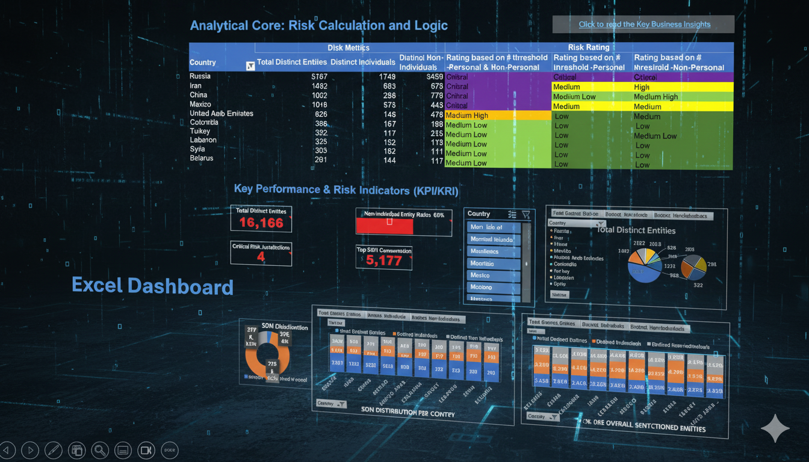

<h1 align="center">OFAC SDN Risk & Concentration Dashboard</h1>

  <i>Global Sanctions Analytics for Compliance, AML, and Enterprise Risk</i>

  

https://atsuvovor.github.io/MS_Excel_Power_Pivot_Power_Query_Projects/ofac_sdn_sanctions_dashboard.html</a>

---

This dashboard provides a structured, Excel-based analytics solution for monitoring global sanctions exposure using the U.S. Treasury’s **OFAC Specially Designated Nationals (SDN)** list. It enables compliance, AML, and risk teams to quickly assess:

* Jurisdiction-level sanctions concentration
* Severity-based risk ratings
* Entity-type distribution (Individual vs. Non-Individual)
* Core compliance KPIs and KRIs

---

## 🛠️ Technology Stack

The dashboard is built entirely in **Microsoft Excel**, using:

* **Power Query** — ETL for SDN & associated list data
* **Power Pivot** — data modeling & relationships
* **DAX Measures** — KPI/KRI logic and filtering
* **PivotTables** — interactive reporting layer

---

## 🔬 Analytical Core: Risk Calculation & Logic

A tiered methodology assigns **Risk Ratings** based on each country’s **Total Distinct SDN Entities**.

| Total Distinct Entities (SDNs) | Risk Rating     | Color Logic     |
| ------------------------------ | --------------- | --------------- |
| **> 1000**                     | **Critical**    | 🔴 Red          |
| **> 800 to ≤ 1000**            | **High**        | 🔴 Red          |
| **> 600 to ≤ 800**             | **Medium High** | 🟠 Orange       |
| **> 400 to ≤ 600**             | **Medium**      | 🟡 Yellow       |
| **> 200 to ≤ 400**             | **Medium Low**  | 🟤 Light Yellow |
| **≤ 200**                      | **Low**         | 🟢 Green        |

This logic allows stakeholders to quickly identify high-risk jurisdictions and understand global concentration patterns.

---

## 🔝 Key Performance & Risk Indicators (KPI/KRI)

| Indicator                       | Type    | Definition & Insight                                                                      |
| ------------------------------- | ------- | ----------------------------------------------------------------------------------------- |
| **Total Distinct Entities**     | **KPI** | Total count of unique SDN entities — measures sanctions volume.                           |
| **Critical Risk Jurisdictions** | **KRI** | Number of countries flagged as *Critical* — highlights immediate compliance exposure.     |
| **Non-Individual Entity Ratio** | **KRI** | Percentage of organizations/vessels — signals systemic sanctions risk beyond individuals. |
| **Top SDN Concentration**       | **KPI** | Maximum SDN total for a single jurisdiction — defines global risk ceiling.                |

---

## 📊 Dashboard Purpose

This analytics product supports:

* **Sanctions compliance monitoring**
* **Risk-based prioritization of jurisdictions**
* **Operational AML decision-making**
* **Regulatory reporting & audit preparedness**
* **Executive-level sanctions intelligence**

---

## 📂 Files and Resources

| File                                       | Description                                                                  |
| ------------------------------------------ | ---------------------------------------------------------------------------- |
| `OFAC_Sanctions_Analytics.xlsx`            | Main Excel analytics model with Power Query, Power Pivot, and KPI/KRI logic. |
| `ofac_sdn_sanctions_dashboard.html`        | Interactive web dashboard viewer with menu navigation.                       |
| `screenshot_Excel_OFAC_KPI_KRI.png`        | KPI/KRI screenshot preview.                                                  |
| `Screenshot_Excel_OFAC_SDN_risk_logic.png` | Risk logic model screenshot.                                                 |

---

## 🌎 Data Source

**U.S. Department of the Treasury — OFAC SDN List**  
[OFAC SDN List](https://home.treasury.gov/policy-issues/financial-sanctions/specially-designated-nationals-list-data-formats) | [Specially Designated Nationals List](https://sanctionslist.ofac.treas.gov/Home/SdnList)  

---

## © Copyright

© **2025 Atsu Vovor — All Rights Reserved**

